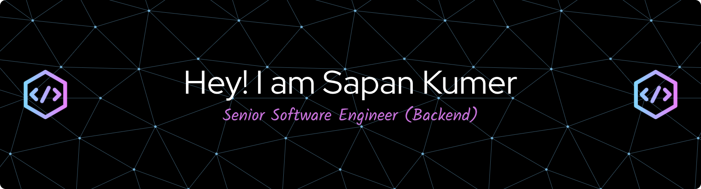

# Hi there, I'm Sapan Kumer 👋

### Senior Software Engineer | Backend & Full-Stack Developer

A passionate **Senior Software Engineer** with **9+ years of professional experience** specializing in backend architecture, ERP solutions, ISP billing systems, CMS platforms, and API integrations. Strong background in both software engineering and quality assurance, ensuring high-performance, maintainable, and reliable enterprise systems.

---

### 🚀 About Me

- 🔭 **Current Role:** Senior Software Engineer at **Mir Info Systems Ltd.**
- 💻 **Core Expertise:** PHP, Laravel, Drupal, REST/SOAP APIs, MySQL, and Docker.
- 🏗️ **Enterprise Solutions:** Architected full-scale ERPs, multi-tenant ISP billing platforms, and high-traffic telecom portals (e.g., Grameenphone).
- 🧪 **Quality First:** 5+ years of foundational SQA experience (manual, load testing with JMeter, UAT), bringing an edge in writing bug-free, resilient code.
- 📍 **Location:** Dhaka, Bangladesh

---

### 🛠️ Tech Stack & Tools

**Languages & Frameworks:**  
`PHP` `Laravel` `Drupal` `Livewire` `JavaScript` `jQuery` `HTML5` `CSS3` `Bootstrap`

**Databases & Storage:**  
`MySQL` `Schema Design` `Query Optimization`

**APIs & Integrations:**  
`REST API` `SOAP API` `Payment Gateways` `Third-Party Integrations`

**DevOps, Testing & Tools:**  
`Docker` `Git` `Apache JMeter` `Linux` `Jira` `CI/CD Workflows`

---

### 💼 Featured Projects & Highlights

- **ISP Billing & Reseller Management System**  
  Multi-tenant platform managing complex ISP reseller hierarchies, automated billing, real-time Livewire filtering, and Docker containerization.
- **Shohel Motors – Automobile ERP**  
  Full-scale ERP covering inventory, CRM, workshop operations, accounting, and barcode scanning with role-based access control (Spatie RBAC).
- **Grameenphone Web, Shop & GPFI**  
  Led backend development, built custom Drupal modules, executed zero-data-loss migration from Drupal 7 to Drupal 9, and ensured 99.9% system uptime.
- **Corporate Portals (Air Astra, Nestlé Bangladesh, IFIC, bKash)**  
  High-traffic web architecture, custom UI components, load testing, and continuous production support.

---

### 📊 GitHub Stats

  
  

---

### 📫 Connect With Me

- **LinkedIn:** [linkedin.com/in/sapan-kumer](https://linkedin.com/in/sapan-kumer/)
- **Email:** [sapankumer4248@gmail.com](mailto:sapankumer4248@gmail.com)
- **WhatsApp / Phone:** +880 1753722859
